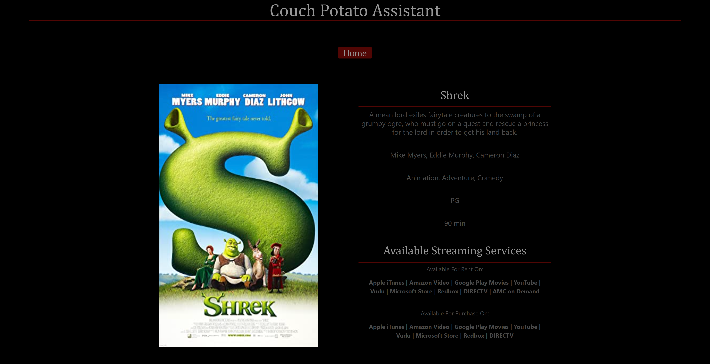

# Couch Potato Assistant

## Description

This is a simple web application for users to type in the name of a show or movie in order to learn more information about that show or movie. 

As our first collaborative assignment in the bootcamp, this project was really useful in setting up Kanban boards in order to assign tasks and organize things that needed to be done. It is also really interesting to incorporate APIs in order to return specific data to the user. 

It was really interesting to learn more about retrieving information from API sources. This really opens the door for the amount of interactivity a webpage or application may have. 

## Usage

To start, simply type the name of a movie into the search box and then click the search button. This will add what the user typed in and store it's data as a recently searched item. 

The user will then be redirected to another page that will display pertinent data to that program (Title, Plot, Actors, Genre, Rating and Runtime) along with the program's poster image. Additionally, this application will display where that movie can be rented or purchased. 

From there, if you were to click on the Home button, then you will be redirected to the home page. The home page will now display the previous 3 movie searches as a button below the search field. Simply click that button to reload the previously displayed movie information. 

## Screenshots for Desktop View

## Screenshots for Mobile View

## Credits

[Chris Simmonds](https://github.com/Christoph551) Github Profile
 

[Leo Segura](https://github.com/lsegura06) Github Profile
 

[Ian Gurgoze](https://github.com/igurgoze) Github Profile

## License

Please refer to the license in the repo. 

## Deployment

A link to the deployed application can be found [Here](https://christoph551.github.io/Couch-Potato-Assistant/)